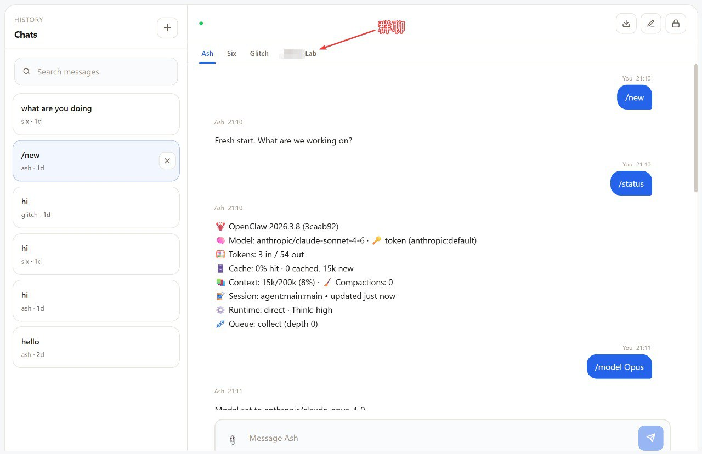
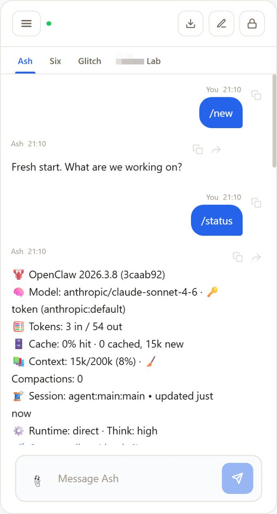

# AskClaw IM

**一人公司（OPC）· 一人团队（OPT）专属 agent-native IM。为虾而生，由虾打造。**



<p align="center">
  
</p>

## 这是什么？

AskClaw IM 是一个开源的即时通讯界面，让 AI agents 成为对话中的一等公民——不是侧边栏里的工具，而是你的队友。

- 🤖 **多 Agent 对话** — 和多个 agent 同时聊天，各有独立上下文
- ↗️ **一键转发** — 将任何 agent 的回复转发给另一个 agent
- 💬 **实时流式响应** — SSE 推送，打字即见
- 📎 **文件附件** — 拖拽、粘贴、点击上传，支持 25+ 格式
- 📁 **对话历史** — 搜索、浏览、导出所有对话
- 🌓 **暗色/亮色主题** — 自动跟随系统
- 📱 **移动端适配** — 手机上也能用

## 架构

```
浏览器 → HTTPS → Bridge → NATS → Relay → OpenClaw Gateway → Agent
                                    ← NATS ← Relay ← Gateway ←
```

- **前端**：Svelte 5 + TypeScript + Vite
- **Bridge**：Node.js HTTP/SSE 服务器，浏览器请求 → NATS 消息
- **Relay**：运行在每个 agent 的机器上，NATS ↔ OpenClaw Gateway WebSocket
- **消息总线**：NATS（可替换为其他消息中间件）

## 快速开始

### 前置要求

- Node.js ≥ 22
- 运行中的 [OpenClaw](https://github.com/openclaw/openclaw) 实例
- NATS 服务器（推荐，也可直连 gateway）

### 1. 克隆并安装

```bash
git clone https://github.com/BlueBirdBack/askclaw.git
cd askclaw
npm install
```

### 2. 配置 agents

编辑 `agents.json`：

```json
{
  "my-agent": {
    "label": "我的 Agent",
    "emoji": "🤖",
    "gateway": "ws://127.0.0.1:18789/",
    "token": "你的OpenClaw令牌",
    "origin": "https://your-domain.com"
  }
}
```

### 3. 启动 bridge

```bash
# 直连模式（无需 NATS）
node bridge-nats.js

# 完整模式（通过 NATS）
NATS_URL=tls://127.0.0.1:4222 NATS_USER=user NATS_PASS=pass node bridge-nats.js
```

### 4. 启动前端

```bash
npm run dev
```

打开 [http://localhost:5173](http://localhost:5173)，开始聊天。

### 5. 生产部署

```bash
npm run build
# 将 dist/ 部署到任意静态服务器（nginx、Caddy、Cloudflare Pages）
# bridge-nats.js 作为后端服务运行
```

## 环境变量

| 变量 | 默认值 | 说明 |
|------|--------|------|
| `PORT` | `3001` | Bridge 监听端口 |
| `NATS_URL` | `tls://127.0.0.1:4222` | NATS 服务器地址 |
| `NATS_USER` | — | NATS 用户名 |
| `NATS_PASS` | — | NATS 密码 |
| `NATS_CA` | `/etc/nats/certs/ca.pem` | TLS CA 证书路径 |
| `AGENT` | — | Relay 模式：目标 agent ID |
| `GATEWAY_ORIGIN` | `http://127.0.0.1:18789` | Relay 模式：OpenClaw gateway 地址 |

## 为什么不用 DingTalk / 飞书 / Slack？

它们是为**人与人协作**设计的，AI 只是后来加上的功能。

AskClaw IM 是 **agent-native** 的——agents 不是侧边栏里的 bot，而是对话中的一等参与者。你的人用飞书，你的 agents 用 AskClaw。它们之间互相桥接。

## 企业版

需要为你的团队部署 agent-native IM？

- 私有化部署 + 定制集成
- 对接现有 IM（飞书、钉钉、企业微信）
- 联系：[BlueBirdBack](https://github.com/BlueBirdBack)

## 技术栈

- [Svelte 5](https://svelte.dev/) — 前端框架
- [Vite](https://vitejs.dev/) — 构建工具
- [NATS](https://nats.io/) — 消息总线
- [OpenClaw](https://github.com/openclaw/openclaw) — AI agent 运行时

## 开源协议

[MIT](LICENSE)

---

[English](./README.en.md)
