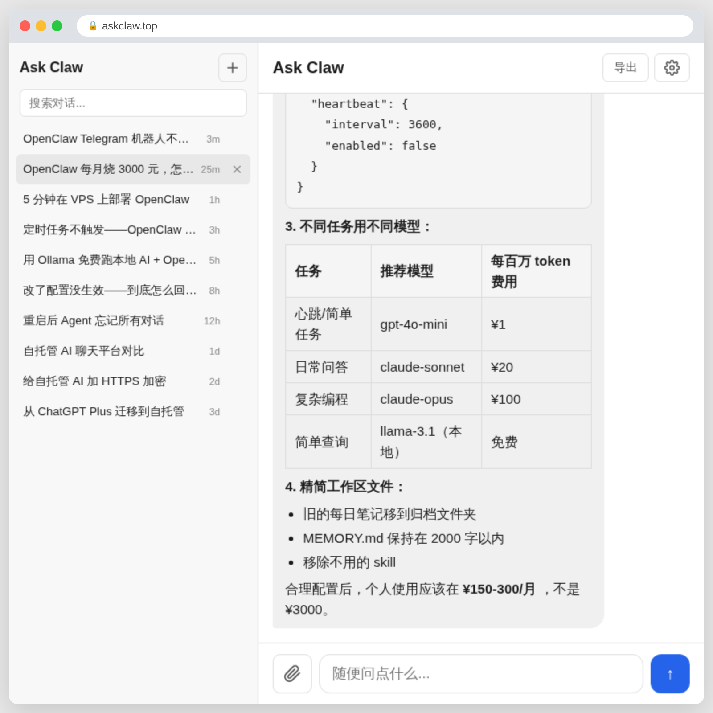
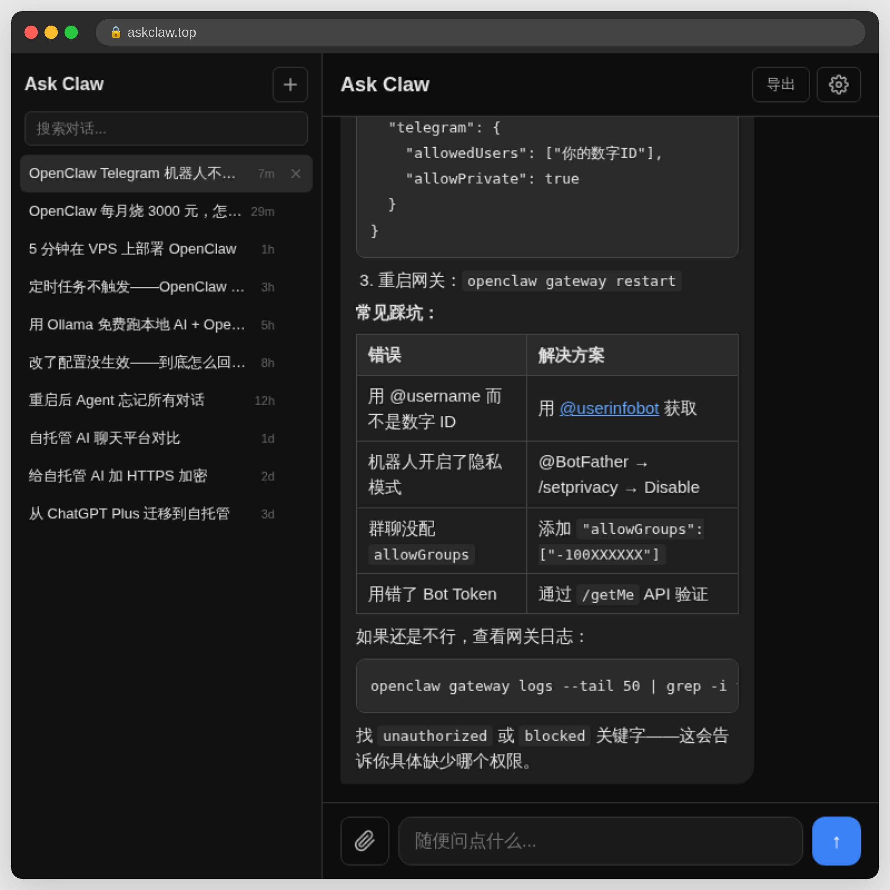
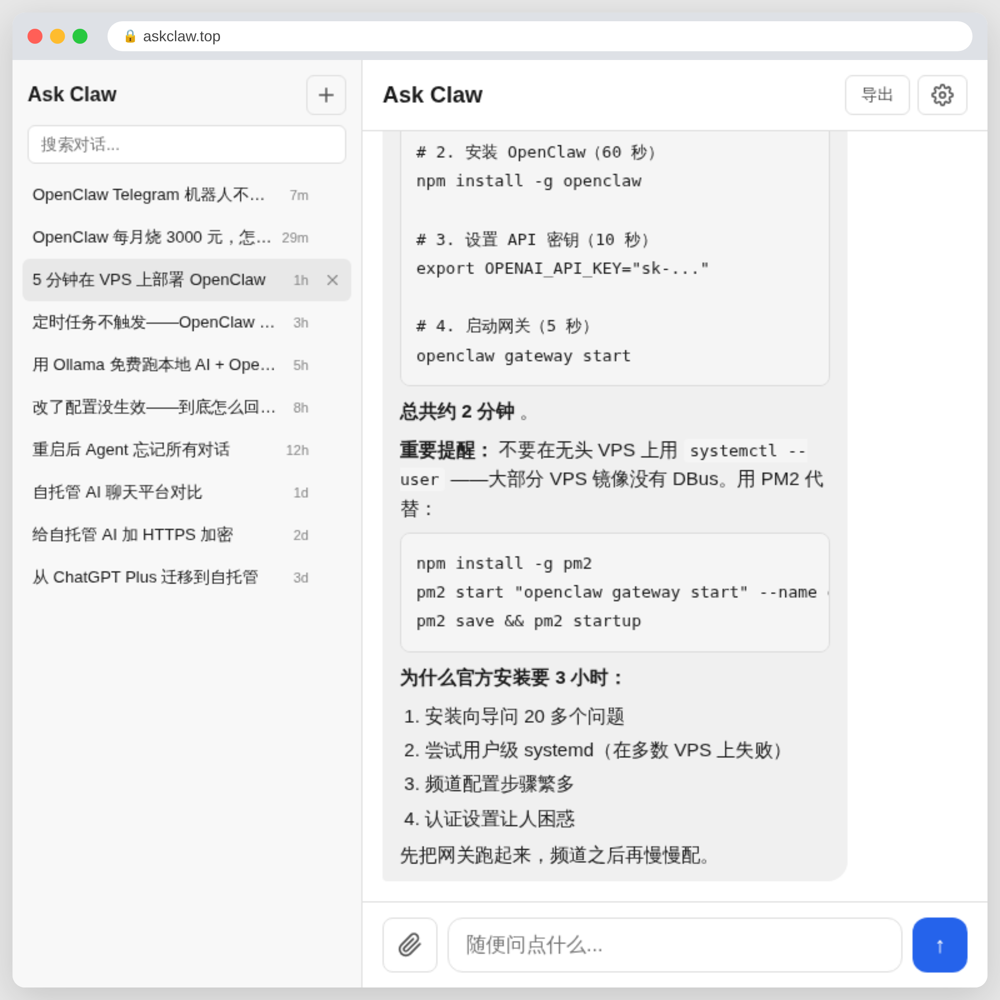
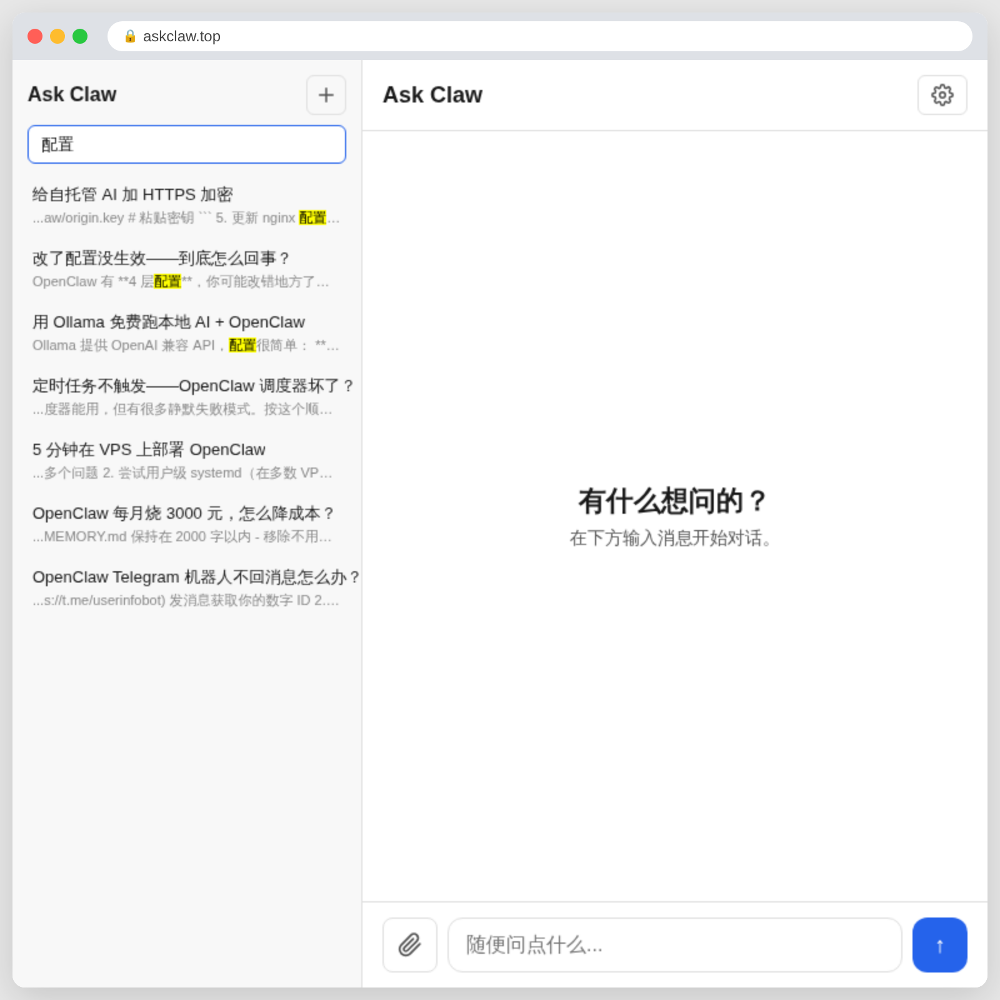

# AskClaw

> OpenClaw 本该自带的 Web UI。  
> 从设计上解决了 [22 个用户痛点中的 15 个](https://github.com/BlueBirdBack/openclaw-pain-points)。  
> 自托管 · MIT 开源协议



[English](README.md) · **中文**

---

## 为什么要做 AskClaw

OpenClaw 功能强大——但自带的 WebChat 很难用。用户反馈了 [22 个主要痛点](https://github.com/BlueBirdBack/openclaw-pain-points)。AskClaw 架在你现有的 OpenClaw 之上，解决其中 15 个：

| OpenClaw WebChat 限制 | AskClaw 补上的能力 |
|---|---|
| WebChat 锁定单设备（CLI 配对） | 多用户——任何浏览器、任何设备 |
| 无法搜索历史对话 | 全文搜索（SQLite FTS5） |
| 无法导出 | 导出 PDF + DOCX |
| 内存压缩静默删除对话记录 | SQLite 持久化——数据不会消失 |
| 远程访问需要 SSH/Tailscale 隧道 | 标准 HTTPS——一个 URL 就行 |
| 没有深色模式 | 自动深色模式（`prefers-color-scheme`） |
| 频道权限迷宫（"机器人在线但不回复"） | 跳过频道配置——AskClaw 本身就是聊天界面 |

AskClaw 是基于 [OpenClaw](https://github.com/openclaw/openclaw) 的自托管对话界面——同样强大，无需折腾。

## 功能特性

- 💬 **实时流式对话** — 回复逐字流出，响应即时
- 👥 **多用户支持** — 每个用户独立会话，共享同一套基础设施
- 📄 **导出对话** — 支持导出为 PDF 或 DOCX 文档
- 🌐 **双语界面** — 内置中英文切换
- 📱 **响应式布局** — 适配桌面、平板与手机
- 🌙 **深色模式** — 自动跟随系统/浏览器主题（`prefers-color-scheme`）
- 🔍 **全文搜索** — 基于 SQLite FTS5，搜遍所有对话记录

- 🔒 **身份认证** — HTTP Basic Auth，每用户独立会话隔离

## 界面截图

**解决真实问题** — 表格、代码块、成本分析，一步到位


**深色模式** — 自动跟随系统/浏览器主题


**快速部署指南** — 可复制粘贴的分步命令


**全文搜索** — 即时查找任何对话


## 技术栈

| 层级 | 技术 |
|---|---|
| 前端 | Svelte 5 + TypeScript + Vite |
| 后端 | FastAPI + Python 3.13 |
| 数据库 | SQLite（WAL 模式 + FTS5 全文搜索） |
| 认证 | HTTP Basic Auth（htpasswd） |
| 导出 | PDF（html2pdf）+ DOCX（docx.js） |
| 国际化 | 自定义方案（中文 + 英文） |

## 系统架构

```
浏览器
  └─▶ nginx（TLS 终止 + Basic Auth 鉴权）
        ├─▶ FastAPI 后端（:8000）  ← 对话记录、文件、搜索
        └─▶ OpenClaw 网关 (:18789)  ← AI 模型、Agent、工具
```

每个用户拥有独立的会话空间。后端使用 SQLite 存储对话记录并支持全文检索。AI 服务商可通过一个环境变量随时切换。

## 快速开始

### 前置要求
- Python 3.13+
- Node.js 18+
- 一个运行中的 [OpenClaw](https://github.com/openclaw/openclaw) 网关

### 启动后端

```bash
cd server
python -m venv .venv && source .venv/bin/activate
pip install -e .
uvicorn askclaw.main:app --host 127.0.0.1 --port 8000
```

### 启动前端

```bash
npm install
npm run dev        # 开发模式
npm run build      # 生产构建 → dist/
```

### 环境配置

```bash
# 复制示例文件并填写配置
cp server/.env.example server/.env
```

**指向你的 OpenClaw 配置：**
```bash
ASKCLAW_OPENCLAW_CONFIG=/root/.openclaw/openclaw.json
```

### OpenClaw 专属 Agent

AskClaw 使用一个独立的 OpenClaw Agent（`openclaw:askclaw`），配备最简工作空间，防止主 Agent 的系统提示词污染用户对话。详见 [`docs/openclaw-agent.md`](docs/openclaw-agent.md)。

### 生产环境（nginx）

完整的 nginx + TLS + Basic Auth 配置方案，参见 [`docs/nginx.md`](docs/nginx.md)。

## 项目结构

```
/
├── src/                    # Svelte 5 前端
│   ├── components/         # 对话界面组件
│   └── lib/               # API 客户端、国际化、导出、状态管理
├── server/
│   └── askclaw/           # FastAPI 后端
│       ├── routers/       # API 路由（对话、文件、认证、搜索）
│       ├── main.py        # 应用入口
│       ├── models.py      # Pydantic 数据模型
│       └── db.py          # SQLite + FTS5
└── public/                # 静态资源
```

## 线上演示

[askclaw.top](https://askclaw.top) — 演示部署。

## 路线图

- [ ] Docker Compose 一键部署
- [ ] 单次对话多模型切换
- [ ] 团队 / 组织支持
- [ ] 用量统计面板

## 开源协议

MIT — 详见 [LICENSE](LICENSE)

## 依赖项目

- [OpenClaw](https://github.com/openclaw/openclaw) — 驱动后端的多 Agent AI 框架
- [Svelte](https://svelte.dev) — 前端框架
- [FastAPI](https://fastapi.tiangolo.com) — 后端框架
